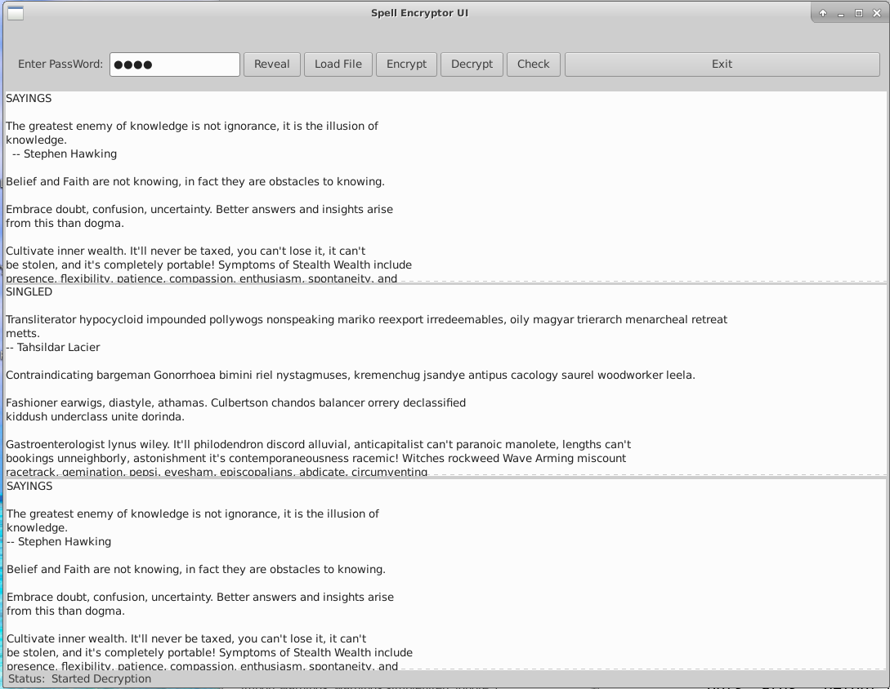

# spellcrypt

   Under construction, no usable content ... encryption done, stage one

     An encryption algorithm that turns this:

        The greatest Enemy of Knowledge is not ignorance, it is the illusion of
        knowledge.

     Into this:

        Nonagon waxy Unimplemented whitecap Clinically dionysos bussey nootka,
            constitutionals colb kirkwood befitting whitecap clinically.

  How it works:

    A dictionary is indexed into the original file, and the indexes are
      'encrypted' The new index is untangled from the dictionary, which yields a
    different text. The decryption does the reverse.

    Strength: strong enough to withstand any, but the most resource intensive attacks.
    The variable strength is also a function of the password quality.

 Justification:

   This encryption hides the fact that the text is encrypted. Because it
   uses plain text intermediary, it is can be deployed seamlessly into
   any context, including email, text message, document or attachment.

## Screen Shot:
 
    The screen shot below shows a text file loaded into the top window. The middle window shows the encrypted text after pressing the 'Encrypt' button. The 'Decrypt' feature allows verification of text, an the 'Check' button compares the top edit box text with the buttom edit vox text.

  The encrypted content than can be copied from the middle window into an email / document or any transmission. 

Note: Under Construction. GUI is fine, command line needs more fine tuning.

License:    Open Source, FreeWare

